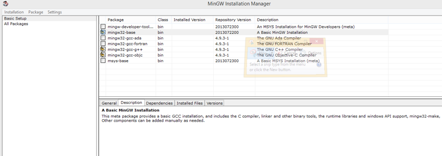
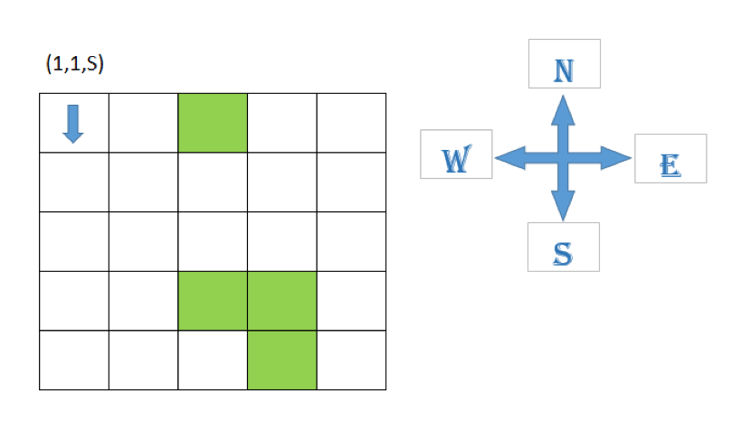
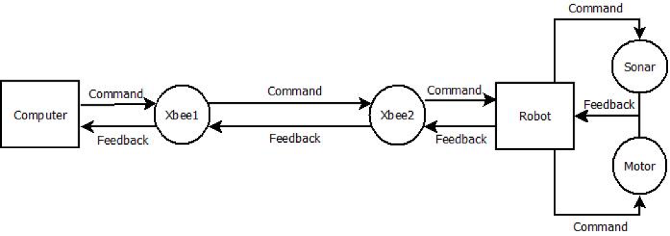
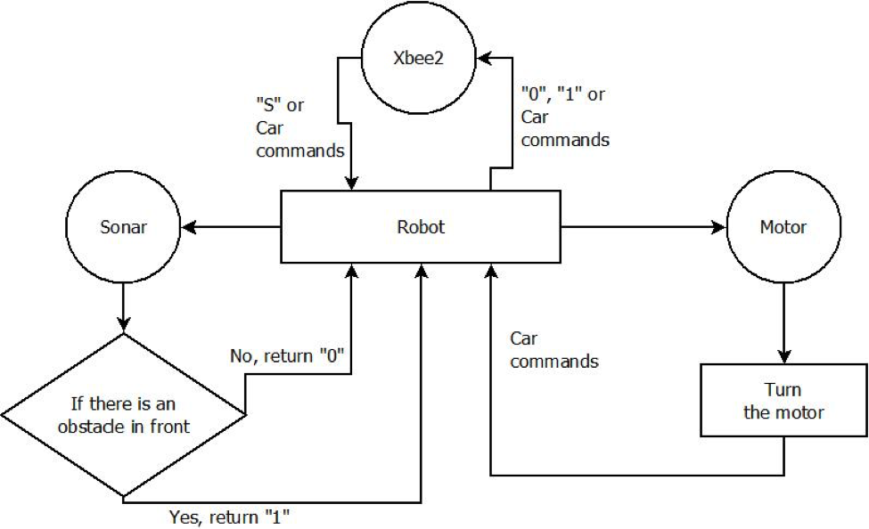
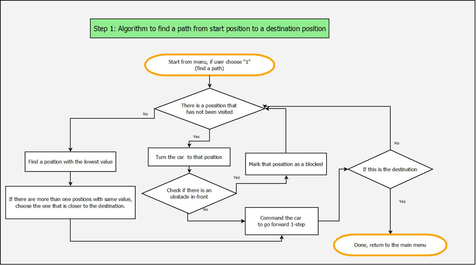

Path Finding and Mapping Autonomous Ground Vehicle
--------------------------------------------------

**Developed by:** Hung Do (M.S.C.S)

Khiem Huynh (B.S.E.E)

Dr. Gene Hou (Department of Mechanical Engineer)

Abstract- Will be added
-----------------------

<a href="https://www.youtube.com/watch?v=x5VYHYvMxWk&feature=youtu.be
" target="_blank"></a>


Table of Contents
-----------------

> 1\. Software requirements
>
> 1.1 CodeBlocks Installation
>
> 1.2 MinGW Installation
>
> 1.3 Arduino Libraries
>
> 2\. Programs
>
> 3\. Chess box design
>
> 4\. Algorithms
>
> 4.1 Data Flow
>
> 4.2 First step (finding path)
>
> 4.3 Second step (Shortest path)
>
> 5\. Coding explanation
>
> 5.1 Coding for the car (client)
>
> 5.2 Coding for computer (server)
>
> 6\. Tasks Given
>
> List of Tables:
>
> 1\. Car Commands
>
> List of Figures:

1\. MinGW requirements

2\. Overall Data Flow

3\. Computer Data Flow

4\. Arduino Data Flow

5\. Chessboard design

6\. First Trial Algorithms

7\. Dijkstra's algorithm

> References
>
> 1\. Animation

1. Software requirements
========================

1.1 CodeBlocks installation
---------------------------

Please visit the website below to install CodeBlocks. This software is
highly recommended to use in this project.

Website: *http://www.codeblocks.org/downloads/26*

1.2 MinGW installation
----------------------

MinGW is required when installing Codeblocks. The following link below
is an address to download MinGW

Website:*https://sourceforge.net/projects/mingw/files/Installer/*

During the installation of MinGW please revise figure 1 given below to
install MinGW correctly.

**Note:** Select options as the screenshot below:



Figure 1: MinGW requirements

1.3 Arduino libraries
---------------------

**NewPing:** This library gives the capability of using ultrasonic
sensors.

**AccelStepper**, **AFMotor**: These libraries grant the accessibility
to several functions which allow controlling stepper motors

These libraries are available on the internet. They can be easily found
on Google, or Github.

**Note:** Github is highly recommended

2. Programs
===========

-   An example program is given in order to manually control the robot
    for testing purposes(Car-Control-Manually)

-   An example for the first two tasks is available
    through Blackboard(Lucky-2Steps-2)

-   Watch a demo on this video: *https://youtu.be/x5VYHYvMxWk*

3. Chess box design
===================

This project will be accomplished by denoting the mapping area into a
chessboard map. This chessboard map is used to identifying and locating
the position and direction of the robot. The length and dimension of the
chessboard can be preset which give the power to cover a specific area.


===============================================================================

Figure 2: Chessboard design

4. Algorithms
=============

 4.1 Data Flow
--------------



Figure 2: Overall Data Flow

The figure shown above explains how the data interacts between the
computer and the Arduino using Xbee. First the computer will send a
command to Xbee1, which is connected to the computer. Then, the Xbee1
will pass the command to Xbee2, which is connected to the Arduino. After
receiving the command from Xbee1, Xbee2 will denote the information to
Arduino language in order to operate the command. The denoted command
then will be sent to either sonar or the motor. After completing the
task, the sonar or motor will send a feedback signal back to the Arduino
to notify the completion.The feedback will be sent to Xbee2, then Xbee1
and finally back to the computer to update the status



Figure 3: Computer Data Flow

Figure 3 shown above informs the data flow on the computer side. The
computer will first order the commands to Xbee1. And, after receiving
the feedback from the Xbee1. The data will be updated into three
categories, such as Direction, Location, and Map characteristic.


Figure 4: Arduino Data Flow

In figure 4, Xbee2 acts as an intermediate which communicates between
Arduino and a computer wirelessly. The commands order from the computer
will be denoted to Arduino language.

When receiving an "S", Arduino will get sensor value from sonar sensors
to determine the availability of the front box. The sonar will send a
feedback of “1” to the Arduino when there is an obstacle in front. And,
“0” when there is not.

When receiving car commands, Arduino will order the motor to turn the
robot according to the table shown below.

  **Car commands**   **Action **
  ------------------ -------------------------------------
  “L”                Turn left
  “R”                Turn right
  “F”                Go Forward
  “B”                Turn around
  Integer            Go forward according to the integer

Table 1: Car Commands

4.1 First Trial(finding path)
-----------------------------

Will be added



Figure 3: First Trial algorithms

4.2 Second Trial(Shortest path)
-------------------------------

In this Trial, Dijkstra's algorithm is applied to determine to the
shortest path from point to point. The collected data from the first
trial will be used to calculate the shortest path from starting point to
the destination.

**Reminder:** The route that the second trial takes might be the same as
the first trial. The difference is the travel time will be shorter since
there is no decision making.

**Note:** This document will not discuss about Dijkstra’s algorithm. For
further explanation of Dijkstra’s algorithm, please visit Wikipedia or
any other website.
 

5. Coding explanation
=====================

5.1 Coding in the robot (client)
--------------------------------

Will be added
-------------

5.2 Coding in computer (server)
-------------------------------

Two parts:

-   First trial: how to find a path from point to point

-   Second trial: Based upon information collected from the first trial,
    find the shortest path from the starting point to the destination.

Server: main.cpp, runningcar.cpp, runningcar.h, Serial.cpp, Serial.h

**Main.cpp** has four functions:
```c
main()

void step1_getmapinfo(Position CurrPosCar)
void step2_shortpath()
char Command_Sensor(char *ch)
void Command_Data (char *ch, int sleeptime)
```

**Runningcar.h** stores abstracts of functions and variables as follow:

 

```c
//Reset data  
void dataInitialize();  
  
//Check the Final Destination. 
bool checkFinishPos (Position v_Pos);  
  
//Check the availability of the front box.
bool checkBlockPosition(Position v_Pos);  
  
//Check chessboard boundary conditions.
bool checkBoundary(Position v_Pos);  
  
//Mark the unavailable box.
void blockPosition(Position v_Pos);   
  
//Set the status of current position as visited
void setVisit (Position *v_Pos);  
  
//Print current map status  
void PrintBoard();  
  
//Get a shortest path based on Dijkstra's algorithm  
void GetShortestPath();  
  
//Get steps that the car can travel in one command   
int GetNumberOfSteps (int v_travelPos);  
  
//Determine the next step and direction using the current direction and position
char get_next_direction (int v_pos, char v_dir);  
  
//Go forward  
void GoForward(Position *v_currPos);  
  
//Calculate the distance from current position to the destination  
int CalDistance(Position v_Pos,Position v_FinishPos);  
  
//Check the availability of nearby boxes.
char GetPosNotChecked(Position v_currPos);  
  
//Translate a near-by box to position   
//For example: a left position of current position (3,4,N) is (2,4)  
Position getPos(Position v_Pos,char v_side);  
  
//Check the min value (number of visits) of near-by positions  
char GetMinValue (Position v_currPos);  
  
//Turn the car to the Left ‘L’, Right ‘R’, or Turn Around ‘B’ 
void TurnTheCar(Position *v_currPos, char v_turn);  
  
//Check if there is an obstacle in-front: sensor data (1) is blocked, (0) is free to go  
bool checkBall(Position v_currPos, char v_sensor_data);  
  
//A function in second step which displays the results  
void setCurrentTravel(Position *v_currentPos,int i); 

```


**Runningcar.cpp** stores functions content.

Please have some further reading into the content of each function.

6. Tasks Given 
===============

-   Calculate total time for the shortest path run and print out
    the result.

-   Make adjustments to make the robot move faster(Explain how).

-   Be able to manipulate the size of the chessboard, and the starting
    and finish point of the project.

-   Change distance of each step (Explain how).

References

1\. Animation from
*https://en.wikipedia.org/wiki/Dijkstra%27s\_algorithm*
